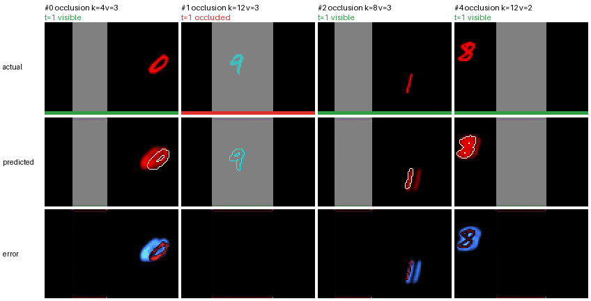
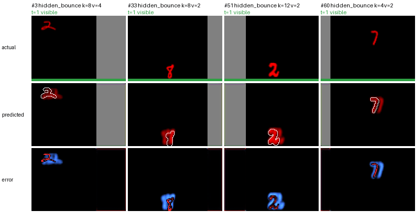

# Peekaboo: Do Predictive Coding Networks Keep Track of Hidden Objects?

Controlled occlusion benchmark and analysis of PredNet: tracking through occlusion, reappearance, and surprise.

<p align="center">
  
  
</p>
<p align="center"><sub>Pilot PredNet on validation sequences: occlusion (left) and hidden bounce (right). For each sequence: true frame (hidden ink in cyan), prediction made before the frame arrives, prediction error.</sub></p>

A digit moves behind an occluder and reappears, as expected or in a surprising way. We measure what a predictive coding video model (PredNet) predicts during and after the occlusion, what its internal state still encodes about the hidden object, and how strongly its prediction errors react to surprising reappearances. The project provides:

- a synthetic occlusion generator with full ground truth (hidden positions, amodal frames, scripted surprises);
- a clean PyTorch PredNet, with ablations, a ConvLSTM baseline, and programmed trackers (Kalman filters);
- a measurement protocol, latent probes, and visualizations.

## Research questions

1. **Tracking through occlusion.** While the object is hidden, how fast does each model lose it? We read the answer both from the predicted frames and, with linear probes, from the model's internal state.
2. **Correction after reappearance.** How many frames does each model need to recover when the object comes back, for expected and for surprising reappearances?
3. **Surprise.** Are prediction errors larger after a surprising reappearance than after a matched plausible one? Surprise tests follow the violation of expectation design of PLATO (Piloto et al., 2022): impossible and possible sequences end with the same frames and differ only in their history.

A constant velocity Kalman filter is close to optimal on this synthetic motion. It serves as a reference, not as a competitor.

## Approach

- **Data.** A red MNIST digit moves on 64 x 96 frames and crosses a gray bar that hides it for exactly k frames. The conditions are a matched control (a bar too narrow to hide the digit), occlusion, a bounce off a wall while hidden, and a blackout of the input. Surprises are PLATO style tuples: two plausible sequences and their two impossible splices, cut while the digit is hidden, so the cut itself is invisible. Every frame comes with its exact ground truth, including the position of the hidden digit.
- **Models.** PredNet reimplemented in PyTorch from the paper, its ablations (depth, no explicit error units), a ConvLSTM baseline, and programmed trackers (detector, last seen position, Kalman filters).
- **Readouts.** What the model predicts (the frames above), where it believes the hidden digit is (a linear position probe on its internal state), and what it imagines behind the bar (an amodal decoder).

The details are in [docs/implementation.md](docs/implementation.md).

## Results so far

Before any occlusion analysis, a model must predict the next frame well: on frames where the digit is visible and moving, its error must be at least 30% below the better of two baselines, copying the last frame and the frame without its digit (gate D16). Next frame MSE on these frames of the validation set:

| Model | Training loss | MSE | Below the blank frame | Below the copy | Gate |
| --- | --- | --- | --- | --- | --- |
| copy of the last frame | | 0.00263 | | | |
| blank frame (digit erased) | | 0.00205 | | | |
| PredNet 5 layers | PredNet's own loss | 0.00205 | 0% | 22% | failed |
| PredNet 5 layers | visible digit pixels weighted by 10 | **0.00010** | **95%** | **96%** | passed |

With its own loss, PredNet learns the bar and the background perfectly but never draws the digit, which covers only 0.4% of the loss values. Weighting the visible digit pixels by 10 fixes it: the digit is drawn sharp and in place (SSIM 0.999), at every speed and in every condition. The first figures already point at tracking: the model draws the part of the digit that emerges from the bar, and brings a digit back at about the right time after a hidden bounce. The full analysis is in [docs/experiments.md](docs/experiments.md).

## Status

| Phase | Content | State |
| --- | --- | --- |
| 1 | Occlusion generator, surprise tuples, ground truth, validation and test sets, PredNet | done |
| 2.1 to 2.4 | Training, evaluation, prediction figures, and the pilot run of PredNet | done |
| 2.5 to 2.10 | PredNet ablations, ConvLSTM, trackers, position probe, amodal decoder, training sweep | planned |
| 3 | Evaluation on the test set: occlusion curves, correction latency, surprise | planned |

The detailed status of every step is in [docs/implementation.md](docs/implementation.md#status).

## Quick start

```
mamba env create -f environment.yml
mamba activate peekaboo
python -m pytest

python -m scripts.prepare_mnist                                   # download MNIST, build the digit pools
python -m scripts.make_dataset --config configs/data/val_v1.yaml  # the validation set
PYTORCH_ENABLE_MPS_FALLBACK=0 python -m scripts.train --config configs/train/smoke.yaml  # one minute training run
python -m scripts.eval_next_frame --run runs/pilot_prednet5l_w10/seed0   # gate D16 of the pilot model
python -m scripts.show_predictions --run runs/pilot_prednet5l_w10/seed0  # its prediction figures
```

The code runs on CUDA, Apple GPUs (MPS), and CPU. The pilot model is included in the repository, so the last two commands need no training. Every command, with its options and expected output, is in [docs/usage.md](docs/usage.md).

## Repository layout

```
peekaboo/   the package: data generator, models, training, evaluation, figures
scripts/    command line entry points
configs/    one config file per dataset, model, and training run
tests/      unit tests (pytest)
docs/       implementation, usage, and experiments
runs/       the reference pilot run (other runs, data, and figures stay local)
```

The full tree is in [docs/implementation.md](docs/implementation.md#repository-layout).

## Documentation

- [Implementation](docs/implementation.md): the generator, the datasets, the models, training and evaluation, module by module.
- [Usage](docs/usage.md): setup and every command, with what it does and its expected result.
- [Experiments](docs/experiments.md): each training experiment, its results, and the decisions it led to.

## References

- R. P. N. Rao and D. H. Ballard. Predictive coding in the visual cortex. *Nature Neuroscience*, 1999.
- W. Lotter, G. Kreiman, and D. Cox. Deep predictive coding networks for video prediction and unsupervised learning. *ICLR*, 2017.
- R. Rane, E. Szügyi, V. Saxena, A. Ofner, and S. Stober. PredNet and predictive coding: a critical review. *ICMR*, 2020.
- X. Shi, Z. Chen, H. Wang, D.-Y. Yeung, W. Wong, and W. Woo. Convolutional LSTM network: a machine learning approach for precipitation nowcasting. *NeurIPS*, 2015.
- N. Srivastava, E. Mansimov, and R. Salakhutdinov. Unsupervised learning of video representations using LSTMs. *ICML*, 2015.
- L. S. Piloto, A. Weinstein, P. Battaglia, and M. Botvinick. Intuitive physics learning in a deep-learning model inspired by developmental psychology. *Nature Human Behaviour*, 2022.
- A. Shamsian, O. Kleinfeld, A. Globerson, and G. Chechik. Learning object permanence from video. *ECCV*, 2020.
- M. Traub, F. Becker, S. Otte, and M. V. Butz. Learning object permanence from videos via latent imaginations. *ICANN*, 2024.

This project reimplements PredNet from the paper and uses the original code and OpenSTL as read only references. See [THIRD_PARTY_NOTICES.md](THIRD_PARTY_NOTICES.md).

## License

The code of this project is released under the [MIT License](LICENSE). Third party references keep their own licenses.
