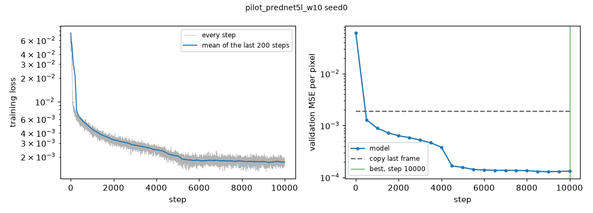
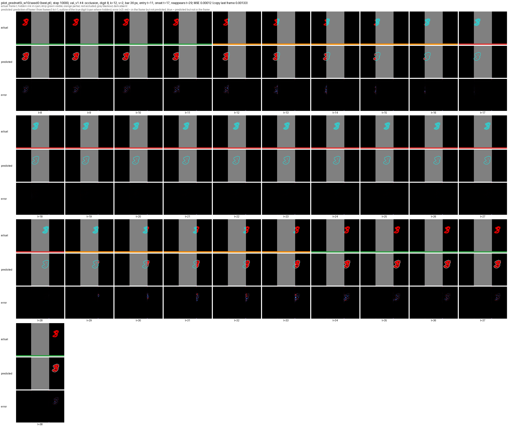

# Experiments

The lab notebook of the project: each training experiment, what it showed, and the decisions it led to, in the order they were run. How the code works is in [implementation.md](implementation.md), and the commands that reproduce each run are in [usage.md](usage.md).

## Step 2.4: pilot training of PredNet 5 layers

**First pilot: PredNet's own loss fails.** PredNet 5 layers, 10k steps of 16 sequences of 40 frames (`configs/train/pilot_prednet5l.yaml`). The loss fell below the plateau where only the bar is known, but from step 3500 on the validation MSE stayed at 0.00149, the MSE of the blank frame (the true frame with its digit erased, 0.00148). The learning rate drop at step 5000 did not change it. The prediction figures show a perfect bar and background, and no digit at all. On the visible moving frames of `val_v1`, the MSE was 0.00205 against 0.00205 for the blank frame and 0.00263 for the copy: the gate D16 failed.

The cause is the sparsity of the digit in the loss. The red digit covers about 1.2% of the pixels, on one channel out of three, so about 0.4% of the loss values, against about 7% in the usual Moving MNIST (two white 28 px digits on 64 x 64 frames), where PredNet learns to draw digits. With an L1 loss, a pixel that is unlikely to hold ink is best predicted empty: as long as the model cannot place the digit to the pixel, erasing it costs less than drawing it, and the model settled there.

**Two fixes, tried for 2000 steps each** (`scripts/trial_pilots.py`, same initialization and training sequences, constant learning rate):

| Variant | Validation MSE at step 2000 | Blank frame | Below the blank frame |
| --- | --- | --- | --- |
| first pilot, for comparison | 0.00161 | 0.00148 | -9% (then 0%) |
| white digit (three channels), PredNet's own loss | 0.00446 | 0.00444 | -0.5% |
| red digit, visible digit pixels weighted by 10 | 0.00063 | 0.00148 | +57% (13%, 40%, 51%, 57% at steps 500 to 2000) |

A white digit, three times heavier in the loss, still settled on the blank solution. The weighted loss drew the digit within 500 steps, sharp and in the right place, and after only 2000 steps passed the gate D16 by far: on the visible moving frames, an MSE 72% below the blank frame and 78% below the copy, at every speed, in every condition, and for every k (59% below the blank frame at k = 12). The drawn digit is slightly thicker than the true one, as expected when missing ink costs ten times more than extra ink.

**Decision (D12).** Every learned model trains with the visible digit pixels weighted by 10 (`loss.digit_weight: 10`). The weight changes only the training objective, uses only ink visible in the target frame, and gives no information about a hidden digit.

**Full pilot with the weighted loss: the gate passes by far.** Same settings as the first pilot, with the digit weight of 10 (`configs/train/pilot_prednet5l_w10.yaml`, 10k steps, about 5 h 30 on an Apple M5). On the visible moving frames of `val_v1`, the best checkpoint (step 10000) has an MSE of 0.00010, 95% below the blank frame (0.00205) and 96% below the copy (0.00263), with an SSIM of 0.999. The reduction against the blank frame is between 94% and 96% in every condition, at every speed, and for every k, so PredNet does not fall back to copying on fast digits.

| Step | 500 | 1000 | 2000 | 3000 | 4000 | 4500 | 5000 | 6000 | 8000 | 10000 |
| --- | --- | --- | --- | --- | --- | --- | --- | --- | --- | --- |
| Validation MSE (all frames, blank frame 0.00148) | 0.00129 | 0.00089 | 0.00063 | 0.00053 | 0.00038 | 0.00017 | 0.00016 | 0.00014 | 0.00014 | 0.00013 |

The validation MSE fell by half between steps 4000 and 4500, a sudden change in what the model had learned, 500 steps before the learning rate drop. After the drop, it improved only slowly. With another seed or another model, such a change could come after the drop, and much later with a learning rate ten times smaller: the training sweep (step 2.10) should therefore keep the high learning rate longer, for example 15k steps with the drop at 10k, and check that every run has passed this change before its drop.

Training loss and validation MSE of the weighted pilot, against copying the last frame.

The prediction figures show the digit drawn sharp and in place on every visible frame, and nothing under the bar, which is the correct prediction of the next frame there. Two examples already point at tracking. In an occlusion sequence, the model draws the part of the digit that comes out at the edge of the bar in the first frame of the reappearance, from frames in which the digit was fully hidden. In a hidden bounce sequence, it draws the digit coming back out on the side it entered, at about the right time. Phase 3 measures this on the whole test set.

Frames around a crossing of `val_v1`: the true frame (hidden ink in cyan), the prediction with the outline of the true digit, and the pixel error (red: missed, blue: extra).

The run is kept in git as the reference result of step 2.4: `runs/pilot_prednet5l_w10/` (settings, logs, curves, `best.pt`, evaluation, and prediction figures) and its output `runs/pilot_prednet5l_w10.log`.
