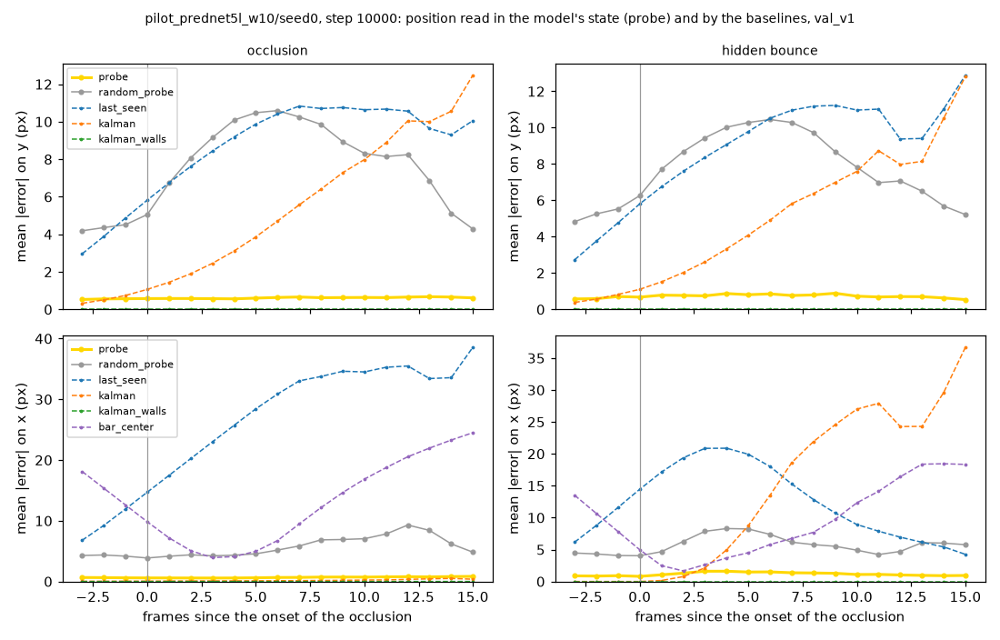
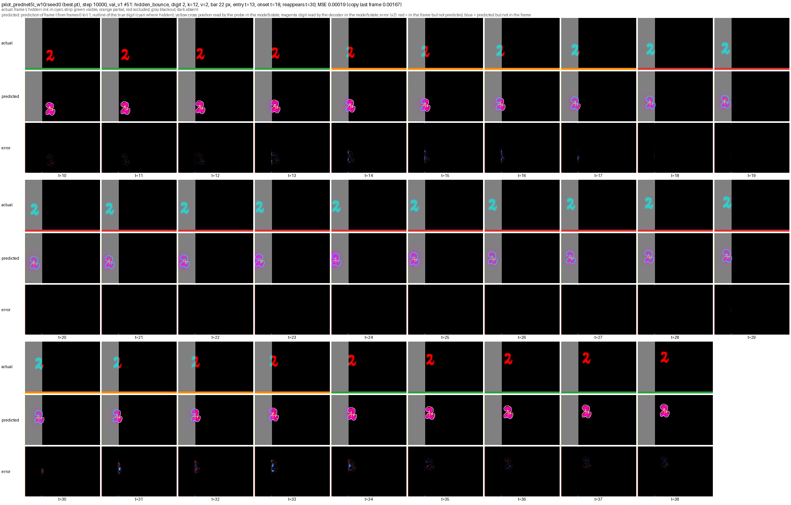

# Experiments

The lab notebook of the project: each training experiment, what it showed, and the decisions it led to, in the order they were run. How the code works is in [implementation.md](implementation.md), and the commands that reproduce each run are in [usage.md](usage.md).

## Step 2.4: pilot training of PredNet 5 layers

**First pilot: PredNet's own loss fails.** PredNet 5 layers, 10k steps of 16 sequences of 40 frames (`configs/train/pilot_prednet5l.yaml`). The loss fell below the plateau where only the bar is known, but from step 3500 on the validation MSE stayed at 0.00149, the MSE of the blank frame (the true frame with its digit erased, 0.00148). The learning rate drop at step 5000 did not change it. The prediction figures show a perfect bar and background, and no digit at all. On the visible moving frames of `val_v1`, the MSE was 0.00205 against 0.00205 for the blank frame and 0.00263 for the copy: the gate D16 failed.

The cause is the sparsity of the digit in the loss. The red digit covers about 1.2% of the pixels, on one channel out of three, so about 0.4% of the loss values, against about 7% in the usual Moving MNIST (two white 28 px digits on 64 x 64 frames), where PredNet learns to draw digits. With an L1 loss, a pixel that is unlikely to hold ink is best predicted empty: as long as the model cannot place the digit to the pixel, erasing it costs less than drawing it, and the model settled there.

**Two fixes, tried for 2000 steps each** (`scripts/trial_pilots.py`, same initialization and training sequences, constant learning rate):

| Variant | Validation MSE at step 2000 | Blank frame | Below the blank frame |
| --- | --- | --- | --- |
| first pilot, for comparison | 0.00161 | 0.00148 | -9% (then 0%) |
| white digit (three channels), PredNet's own loss | 0.00446 | 0.00444 | -0.5% |
| red digit, visible digit pixels weighted by 10 | 0.00063 | 0.00148 | +57% (13%, 40%, 51%, 57% at steps 500 to 2000) |

A white digit, three times heavier in the loss, still settled on the blank solution. The weighted loss drew the digit within 500 steps, sharp and in the right place, and after only 2000 steps passed the gate D16 by far: on the visible moving frames, an MSE 72% below the blank frame and 78% below the copy, at every speed, in every condition, and for every k (59% below the blank frame at k = 12). The drawn digit is slightly thicker than the true one, as expected when missing ink costs ten times more than extra ink.

**Decision (D12).** Every learned model trains with the visible digit pixels weighted by 10 (`loss.digit_weight: 10`). The weight changes only the training objective, uses only ink visible in the target frame, and gives no information about a hidden digit.

**Full pilot with the weighted loss: the gate passes by far.** Same settings as the first pilot, with the digit weight of 10 (`configs/train/pilot_prednet5l_w10.yaml`, 10k steps, about 5 h 30 on an Apple M5). On the visible moving frames of `val_v1`, the best checkpoint (step 10000) has an MSE of 0.00010, 95% below the blank frame (0.00205) and 96% below the copy (0.00263), with an SSIM of 0.999. The reduction against the blank frame is between 94% and 96% in every condition, at every speed, and for every k, so PredNet does not fall back to copying on fast digits.

| Step | 500 | 1000 | 2000 | 3000 | 4000 | 4500 | 5000 | 6000 | 8000 | 10000 |
| --- | --- | --- | --- | --- | --- | --- | --- | --- | --- | --- |
| Validation MSE (all frames, blank frame 0.00148) | 0.00129 | 0.00089 | 0.00063 | 0.00053 | 0.00038 | 0.00017 | 0.00016 | 0.00014 | 0.00014 | 0.00013 |

The validation MSE fell by half between steps 4000 and 4500, a sudden change in what the model had learned, 500 steps before the learning rate drop. After the drop, it improved only slowly. With another seed or another model, such a change could come after the drop, and much later with a learning rate ten times smaller: the training sweep (step 2.10) should therefore keep the high learning rate longer, for example 15k steps with the drop at 10k, and check that every run has passed this change before its drop.

Training loss and validation MSE of the weighted pilot, against copying the last frame.

The prediction figures show the digit drawn sharp and in place on every visible frame, and nothing under the bar, which is the correct prediction of the next frame there. Two examples already point at tracking. In an occlusion sequence, the model draws the part of the digit that comes out at the edge of the bar in the first frame of the reappearance, from frames in which the digit was fully hidden. In a hidden bounce sequence, it draws the digit coming back out on the side it entered, at about the right time. Phase 3 measures this on the whole test set.

Frames around a crossing of `val_v1`: the true frame (hidden ink in cyan), the prediction with the outline of the true digit, and the pixel error (red: missed, blue: extra).

The run is kept in git as the reference result of step 2.4: `runs/pilot_prednet5l_w10/` (settings, logs, curves, `best.pt`, evaluation, and prediction figures) and its output `runs/pilot_prednet5l_w10.log`.

## Step 2.8: position probe on the pilot model

**Question.** While the digit is fully hidden, the correct next frame shows only the bar, so the predicted frames cannot tell whether PredNet still knows where the digit is. The position probe reads it in the model's internal state instead (option B, decision D15): a linear readout of the centroid from the pooled states R, fitted on the frozen pilot model (`runs/pilot_prednet5l_w10`, step 10000).

**Setup** (`scripts/fit_probes.py`, about 9 minutes). Features: the five layers of R, average pooled to 5,760 values per frame. Probes fitted on the analysis windows of 800 new sequences of the training stream (20,059 frames, hidden frames included), penalties chosen on held out training sequences (ridge alpha 100, logistic C 0.01). Evaluation on the 1000 sequences of `val_v1`, digits never seen in training. Controls: the same probe on the same architecture at random initialization, the programmed trackers of step 2.7, and the bar center for x.

**Result: the state keeps the hidden digit's position almost as precisely as a visible one.** Mean absolute error in pixels on the fully hidden frames of the analysis window (y is the main axis, critique C4):

| Method | occlusion, y | occlusion, x | hidden bounce, y | hidden bounce, x |
| --- | --- | --- | --- | --- |
| probe of the trained PredNet | **0.60** | **0.59** | **0.81** | **1.37** |
| probe of PredNet at random initialization | 9.66 | 5.08 | 9.14 | 6.25 |
| last seen position | 8.88 | 25.79 | 9.47 | 19.67 |
| Kalman, constant velocity | 3.87 | 0.12 | 3.85 | 6.68 |
| Kalman with walls (exact reference) | 0.00 | 0.00 | 0.00 | 0.00 |
| bar center | | 6.31 | | 3.34 |

- On fully hidden frames, the probe's error (0.60 px in y) equals its error on visible frames (0.68 px): hiding the digit costs the state almost no position information.
- The error stays flat over the first 15 hidden frames (figure below), while the last seen position and the constant velocity filter drift away. The state does not just hold the last position: it updates it as the digit moves behind the bar.
- After a bounce off the wall while hidden, the probe still finds the digit (1.4 px in x), where the constant velocity filter is 6.7 px off on average and about 37 px after 15 frames. The state follows the bounce.
- The probe beats the constant velocity filter even in y, where the filter is hurt by vertical bounces just before or under the bar.
- The random initialization control reads the visible digit roughly (4 to 5 px) but loses it once hidden (9 to 10 px, close to the last seen position): the position code of hidden digits comes from training, not from the architecture.
- The 8 bin probe agrees: the probability of the true bin of y is 0.87 on hidden frames of occlusions (0.25 at random initialization, 0.125 by chance).

Mean absolute error on y (top) and x (bottom) against the frames since the onset of the occlusion, for occlusion (left) and hidden bounce (right) sequences of `val_v1`. The probe of the trained model (yellow) stays flat at about 0.6 px.

A hidden bounce of `val_v1` (k = 12, 2 px/frame): the yellow cross, where the probe reads the digit in the state, follows the hidden digit (cyan outline) to the wall and back, through 12 fully hidden frames.

**Limits.** One seed, one model, and the validation set. The probe is trained with hidden frames, so it shows that the information is in the state in a linearly readable form, not that the model uses it the same way as for visible digits. Phase 3 measures this on `test_v1` per k, speed, and condition (blackouts included), on every model of the sweep, and can test whether a probe trained on visible frames only transfers to hidden ones.
